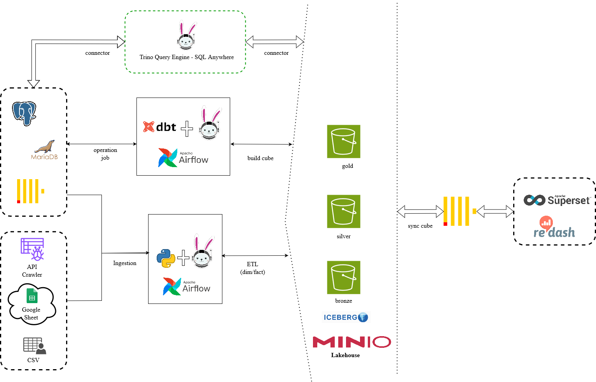

# Trading Data Warehouse Project

Project to run pipeline by following this flow:



**[Document](https://drive.google.com/drive/folders/1PUfJYkZRChRdH8OuSIaEAhrGeqAbqmQU?usp=drive_link)**

- [Trading Data Warehouse Project](#trading-data-warehouse-project)
  - [Prerequisites](#prerequisites)
  - [Setup](#setup)
  - [Infrastructure](#infrastructure)
    - [Notes:](#notes)

Folder structure:

```bash
├── containers                  # Extra for build image
├── docker-compose.yaml         # Orchestrate Airflow, Trino, ... services
├── dags                        # Contains Airflow DAG
├── include                     # Các folder/file để import vào trong DAG
├── plugins                     # Python custom module
├── logs                        # For Airflow save logs
├── .env_sample                 # Sample for file .env
├── requirements.txt            # Contains Python libraby
├── README.md                   # Repo document
└── assets                      # Assets for README.md
```

## Prerequisites

* [Docker](https://docs.docker.com/engine/install/)
* [Docker Compose](https://www.digitalocean.com/community/tutorials/how-to-install-and-use-docker-compose-on-ubuntu-20-04)

## Setup

In order to run the project you'll need to install the following:
 
1. [git version >= 2.37.1](https://github.com/git-guides/install-git)
2. [Docker version >= 20.10.17](https://docs.docker.com/engine/install/) and [Docker compose v2 version >= v2.10.2](https://docs.docker.com/compose/#compose-v2-and-the-new-docker-compose-command).

**Windows users**: please setup WSL and a local Ubuntu Virtual machine following **[the instructions here](https://ubuntu.com/tutorials/install-ubuntu-on-wsl2-on-windows-10#1-overview)**. Install the above prerequisites on your ubuntu terminal; if you have trouble installing docker, follow **[the steps here](https://www.digitalocean.com/community/tutorials/how-to-install-and-use-docker-on-ubuntu-22-04#step-1-installing-docker)** (only Step 1 is necessary). Please install the **make** command with `sudo apt install make -y` (if its not already present). 

All the commands shown below are to be run via the terminal (use the Ubuntu terminal for WSL users). The `make` commands in this repo should be run in the `sapp-lark` folder. We will use docker to set up our containers. Clone and move into the lab repository, as shown below.

```bash
git clone https://gitlab.sapp.edu.vn/data-warehouse/sapp-lark.git
cd sapp-lark
# Grant permission For Airflow wrire and store logs
```


## Infrastructure 

We have three major services that run together, they are:

1. **Postgres database**: We use a postgres database to act as metadata database for Airflow services.
2. **Redis databaser**: We create a redis database to act as broker message queue for `airflow-scheduler`.
3. **Airflow services**: There are 3 main services (`airflow-webserver`, `airflow-scheduler` and `airflow-worker`) and some of additional services (`airflow-init`, `airflow-triggered` and `airflow-log-groomer`). You can read this [document](https://airflow.apache.org/docs/apache-airflow/stable/core-concepts/overview.html) to more understand Airflow.


### Notes:
[1] How to create bot in Telegram: [link](https://stackoverflow.com/questions/31197659/how-to-send-request-to-telegram-bot-api)
