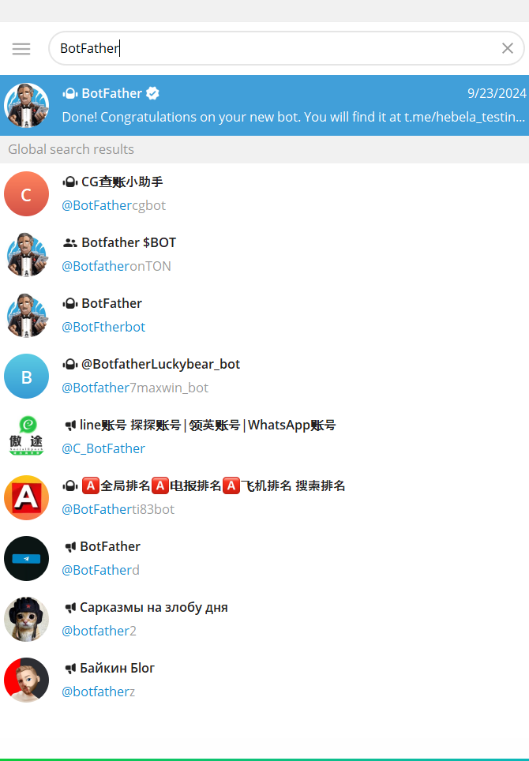
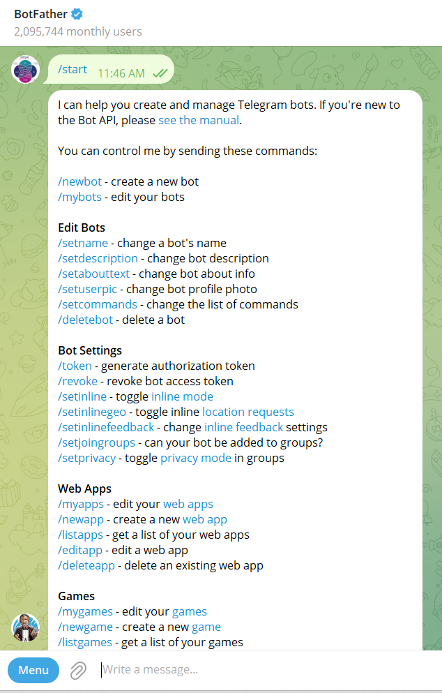
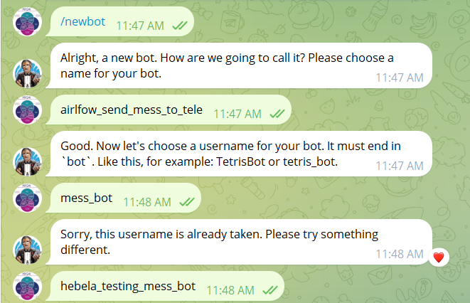
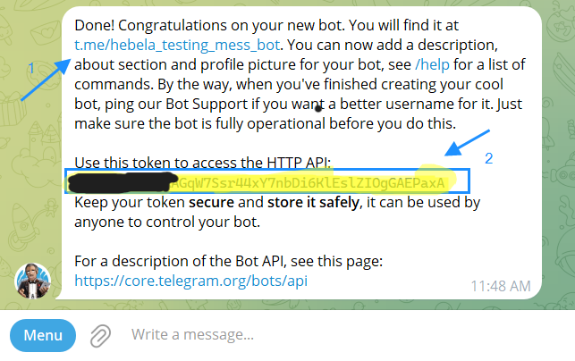
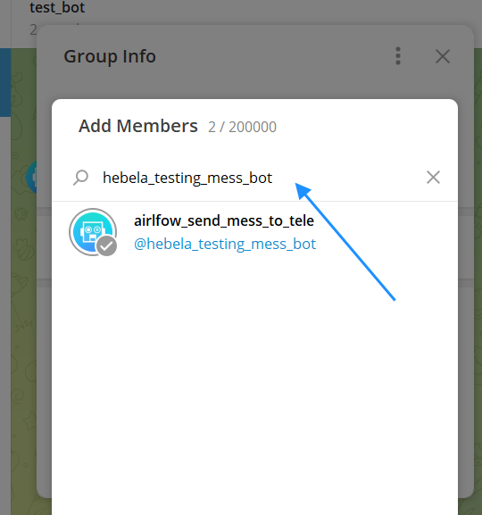
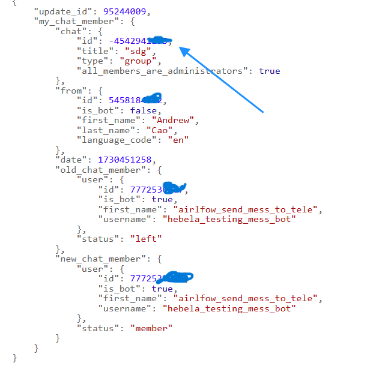

# Tutorial for Getting Telegram Bot Information

## Table of Contents
- [Telegram Bot Creation](#telegram-bot-creation)
- [Get Bot ID](#get-bot-id)
- [Get Group Chat ID](#get-group-chat-id)

## Telegram Bot Creation
1. On the search bar, type "BotFather".
    
    
   
2. Type "/start" into the message box to get started.
    
    
   
3. Type "/newbot". After that send bot's name, username
     
     
    

## Get Bot ID
In the BotFather tab:
- Get bot path from 1.
- Get bot id from 2.
     
     
    

## Get Group Chat ID
1. Add bot to group chat.
    
    
   
2. Call api to get group chat id.
- Send something to group chat.
- Copy and paste this path to browser: https://api.telegram.org/bot<YOUR_BOT_TOKEN>/getUpdates
- Replace YOUR_BOT_TOKEN by your bot token.
- Get id in the chat property.
    
    
    

   